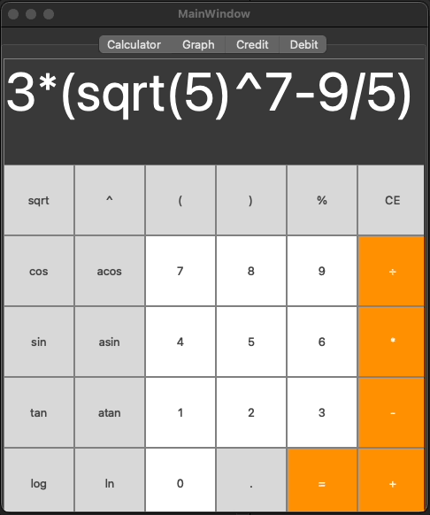

# SmartCalc v2.0

Welcome to the SmartCalc v2.0 repository, an advanced C++ calculator implementing object-oriented programming principles.

## Overview

SmartCalc v2.0 is an OOP modification of the [SmartCalc v1.0](https://github.com/0xmisha/smartcalc_v1.0) , now including the ability to calculate complex arithmetic expressions, utilize the variable _x_, and graph functions. This version also introduces credit and deposit calculators as additional features.

## Features

- **Expression Calculation**: Supports basic arithmetic, mathematical functions, and variable usage.
- **Graph Plotting**: Ability to graph functions using the variable _x_.
- **Credit Calculator**: Special mode for calculating various credit-related metrics.
- **Deposit Calculator**: Functionality to calculate deposit profitability.

## Technical Specifications

- **Language**: C++ (C++17 Standard)
- **GUI**: QT
- **Directory**: Source code in `src` folder
- **Coding Style**: Google C++ Style Guide
- **Namespace**: `s21`
- **Testing**: Comprehensive testing with GTest
- **Build System**: Makefile with standard GNU-program targets

### MVC Pattern

The Model-View-Controller (MVC) pattern is central to the application's design, ensuring a clear separation between business logic (model), user interface (view), and interaction logic (controller).

### Functionalities

- **Dijkstra's Algorithm**: For converting expressions to reverse Polish notation.
- **Arithmetic Operations**: Includes basic operations and mathematical functions like sine, cosine, logarithm, etc.
- **Variable _x_ Usage**: For expressions and graph plotting.
- **Graph Plotting**: With coordinate axes, scale marks, and an adaptive grid. Domain and codomain are within -1000000 to 1000000.
- **Expression Length**: Supports up to 255 characters.
- **Precision**: Accuracy up to 7 decimal places.
- **Arithmetic and Mathematical Functions**: Comprehensive support for various operations and functions in different notations.

### Bonus Features

- **Credit Calculator**: For calculating monthly payment, total overpayment, and total payment based on various inputs.
- **Deposit Calculator**: To compute accrued interest, tax amount, and total deposit value at the end of the term.

## Implementation Details

### Part 1: SmartCalc v2.0

Implementation of the core calculator functionalities with emphasis on the MVC pattern and thorough testing.

### Part 2: Credit Calculator (Bonus)

A specialized mode for calculating various credit-related metrics, inspired by real-world financial calculators.

### Part 3: Deposit Calculator (Bonus)

A mode dedicated to calculating the profitability of deposits, including interest capitalization and various financial inputs.

## Getting Started

Refer to the Makefile for build instructions and explore the `src` folder for source code details. For a deep dive into specific functionalities, the project's documentation and comments provide comprehensive guidance.
